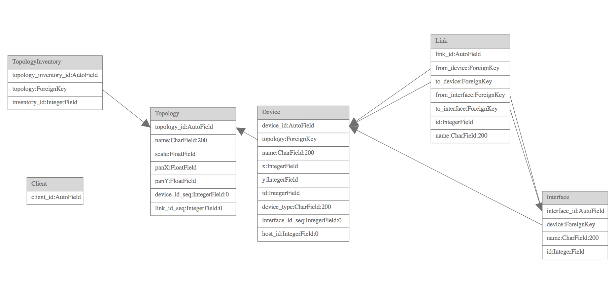

Network UI
==========

See [awx/ui/client/src/network-ui/CONTRIBUTING.md](../ui/client/src/network-ui/CONTRIBUTING.md) for the introduction
to the Network UI client-side development.

Server-Side Development
-----------------------

This document covers the Network UI server-side development.

The Network UI is a UX driven feature to provide a graphical user
experience that fits well into the network engineer's normal workflow. Their
normal workflow includes a diagram drawn in a graphical drawing program, a
spreadsheet, and the command line interface of their network gear.  Network
architects design the network on the graphical diagram and then hand off the
architecture to network operators who implement the architecture on the network
using spreadsheets to manage their data and manually converting the data into
CLI commands using their networking expertise and expertise with their physical
gear.

The server-side code supports the persistence needed to provide this graphical
user experience of architecting a network and using that information along with
additional information (stored in vars files) to configure the network devices
using the CLI or NETCONF using Ansible playbooks and roles.

Network UI Data Schema
----------------------

For the 3.3 release the persistence needed includes the position information of
the devices on the virtual canvas and the type of the devices as well as
information about the interfaces on the devices and the links connecting those
interfaces.

These requirements determine the database schema needed for the network UI which
requires these models: Topology, Device, Interface, Link, Client, and TopologyInventory.

This diagram shows the relationships between the models in the Network UI schema.

Network UI Websocket Protocol
-----------------------------

Persistence for the network UI canvas state is implemented using an
asynchronous websocket protocol to send information from the client to the
server and vice-versa.  This two-way communication was chosen to support future
features for streaming data to the canvas, broadcast messaging between clients,
and for interaction performance on the UI.

Messages
--------

JSON messages are passed over the `/network_ui/topology` websocket between the
test client and the test server.  The protocol that is used for all messages is
in ABNF (RFC5234):

    message_type    =  'DeviceMove' / 'DeviceCreate' / 'DeviceDestroy' / 'DeviceLabelEdit' / 'DeviceSelected' / 'DeviceUnSelected' / 'InterfaceCreate' / 'InterfaceLabelEdit' / 'LinkLabelEdit' / 'LinkCreate' / 'LinkDestroy' / 'LinkSelected' / 'LinkUnSelected' / 'MultipleMessage' / 'Snapshot'
    message_data    = '{' 'msg_type' ': ' message_type ', ' key-value *( ', ' key-value ) '}'
    message         = '[ id , ' posint ']' / '[ topology_id , ' posint ']' / '[' message_type ', ' message_data ']'

See https://github.com/AndyA/abnfgen/blob/master/andy/json.abnf for the rest of
the JSON ABNF.

See [designs/messages.yml](designs/messages.yml) for the allowable keys and
values for each message type.

Initially when the websocket is first opened the server will send four messages
to the client.  These are:

* the client id using the `id` message type.
* the topology id using the `topology` message type.
* a Topology record containing data for the canvas itself.
* a Snapshot message containing all the data of the data on the canvas.

As the user interacts with the canvas messages will be generated by the client
and the `network_ui.consumers.Persistence` class will update the models that
represent the canvas.

